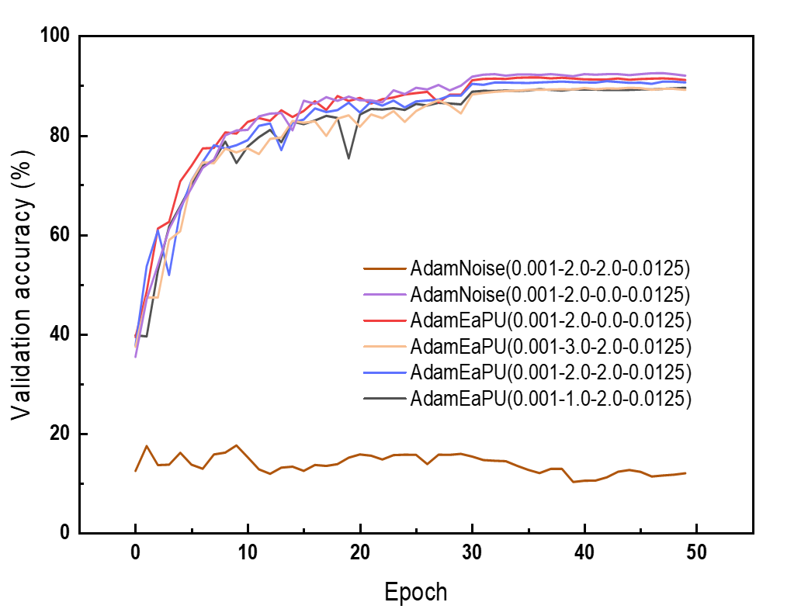

# Experiment_EaPU
The simulation code of EaPU. 

The code includes simulation experiments of the resnet with cifar10/cifar100, the swin transformer with mini-imagenet and the srresnet with ImageNet.

# Pretrained weight
The pretrained weight of the swin transformer is available at https://github.com/SwinTransformer/storage/releases/download/v1.0.0/swin_tiny_patch4_window7_224.pth.

# Data download
Training data in SRResNet download at https://huggingface.co/datasets/goodfellowliu/SRGAN_ImageNet/resolve/main/SRGAN_ImageNet.zip;  
Testing data in SRResNet download at https://huggingface.co/datasets/goodfellowliu/Set5/resolve/main/Set5.zip.    
Then, we can unzip the package and place the folder in `train/train_srresnet/data`.

Mini_imagenet data can be available at https://drive.google.com/file/d/1rK4ihgKpW2iIIs5yWnSFyFYa4FURCxM9/view?usp=drive_link.  
Then, we can uncompress the package and place the folder `images` in `train/train_mini_imagenet/mini_imagenet`.

# Experiment result
## ResNet34 with cifar10

The figure shows the comparison of training with EaPU and the original algorithm. AdamEaPU is the suggested update method, while the AdamNoise represents the original method. The postfix in the legend (a-b-c-d) means the learning rate, the clipped value (clipped value = Vclip/Rwg), the standard deviation of the writing noise, and the Rwg, respectively. When the noise is 0, the AdamNoise is the ideal learning process. Training with EaPU achieves much better results than the original method (89.71 % vs 17.55 %, writing/update noise of 2 μS).

Detailed results and analysis of other simulations can be found at the article "Error-aware Probabilistic Training for Memristive Neural Networks".

# Acknowledgement
https://github.com/kuangliu/pytorch-cifar

https://github.com/Lornatang/SRGAN-PyTorch

https://github.com/WZMIAOMIAO/deep-learning-for-image-processing

